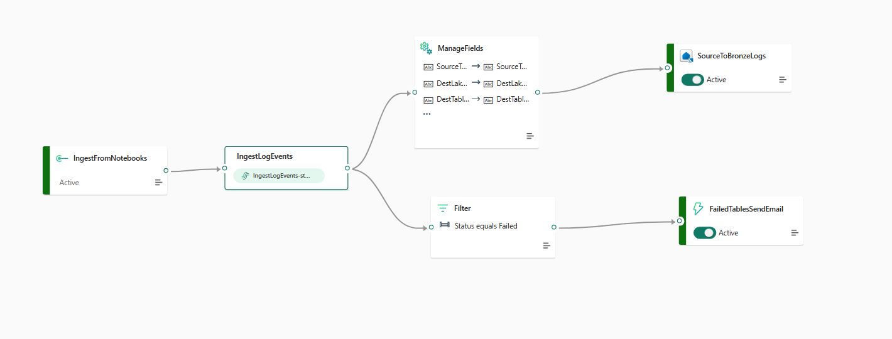

# Send Data Ingestion Logs from Spark Notebooks to KQL Database

## An End-to-End Workflow with Spark Notebooks, Event Streams and Eventhouse Database

## Introduction

In today's data-driven world, the ability to log and monitor data ingestion processes is crucial for ensuring data quality and reliability. This guide will walk you through the process of sending data ingestion logs from Spark Notebooks using our EventStreams module from the DataIngestionFramework package or a standalone implementation. This module leverages the Azure Event Hubs SDK to send logs directly to an event stream, which will then log them into a KQL database inside the Real-Time Intelligence (RTI) experience in Microsoft Fabric.

## Quick Start: Using Pre-Created Fabric Objects

> **Time-Saving Tip**: Instead of creating all the Fabric objects (Event Streams, Eventhouse, KQL Database, and KQL Tables) from scratch, you can simply sync your Fabric workspace with this Git repository. All necessary objects are already created in the `Workspaces/IngestionLogs` directory.

To use the pre-created Fabric objects:

1. Open your Fabric workspace
2. Navigate to Git integration
3. Connect to this repository & select the Workspaces/IngestionLogs directory
4. Sync the workspace to get all the pre-created objects:
   - Event Streams
   - Eventhouse
   - KQL Database
   - KQL Tables

This will save you time and ensure all components are properly configured according to this guide.

If you prefer to create these components from scratch or need to understand how they're set up, continue with the step-by-step instructions below.

## Requirements

To successfully follow this tutorial, you should be familiar with the following:

- Microsoft Fabric
- Spark & Python programming
- Kusto Query Language (KQL)
- Either the DataIngestionFramework package (already installed) or the Azure Event Hubs SDK

## Assumptions

This guide assumes:
- You are working within a Microsoft Fabric Spark environment
- You have the necessary permissions to create Event Streams and KQL tables in Microsoft Fabric
- You either have the DataIngestionFramework package available or can install the Azure Event Hubs SDK

## Overview of the Process

The workflow consists of several key steps:

1. Creating the KQL database and table that will receive the log data
2. Setting up the event streams that will log the data into the KQL table
3. Using the DataIngestionFramework EventStreams module or a standalone implementation to send log messages
4. Optional: Configuring data activator to alert in case of any failures during data ingestion

## Step 1: Creating the KQL Table

If you don't already have an existing Eventhouse and Database, begin by creating an Eventhouse and a KQL Database. You can follow the steps listed in [Real Time Intelligence: Create an event house](https://learn.microsoft.com/en-us/fabric/real-time-intelligence/event-house-overview). 

In this example, my event house name is `IngestionLogsEH`, and the database is `IngestionLogsDB`. Let's create a simple table to store logging data when loading from source to a bronze Lakehouse. Below is an example of the KQL table creation command:

```kql
.create table SourceToBronzeLogs (
    SourceTableName: string,
    DestLakehouse: string,
    DestTableName: string,
    Status: string,
    LogTime: datetime,
    EventProcessedUtcTime: datetime,
    EventEnqueuedUtcTime: datetime,
    PartitionId: int
)
```

## Step 2: Setting Up the Event Streams

Next, set up the event streams that will receive the log data and insert it into the KQL table. The event streams will handle the transformation and insertion process, ensuring the logs are stored in the correct format.

Start with using a custom endpoint and assigning a source name, in this example we will call it `ingestevents`. Add a KQL destination, on data ingestion mode select "event processing before ingestion" and fill in the boxes accordingly pointing to the table created in the previous step `SourceToBronzeLogs`. In this example, there's a ManageFields step, if you're experiencing data type mismatches, you can use this transformation to convert the columns to the required KQL column type. There's also an optional DataActivator. Publish so the stream can go live.



### Securely Storing the Connection String

When you create an Event Stream, a connection string will be generated. This connection string contains sensitive information and should be handled securely.

> **Important Security Recommendation**: Instead of hardcoding the connection string in your code or storing it as an environment variable, consider storing it in Azure Key Vault and accessing it securely from your Spark environment.

There are two recommended approaches for securely accessing your connection string from an Azure Key Vault:

#### Option 1: Using mssparkutils in Fabric Spark

If you're using Microsoft Fabric Spark, you can use the built-in `mssparkutils` to access Key Vault secrets. This will use your Entra ID for authentication, make sure you have the proper permissions for accessing the secret.

```python
# Access Event Streams connection string from Key Vault using mssparkutils
secret_name = "EVENTSTREAMCONN"
key_vault_name = "your-keyvault-name"
key_vault_dns = f"https://{key_vault_name}.vault.azure.net/"

# Get the connection string from Key Vault
eventstreams_conn = mssparkutils.credentials.getSecret(key_vault_dns, secret_name)
```

#### Option 2: Using Azure Key Vault SDK with Service Principal

For more complex scenarios or when running outside Fabric Spark, you can use the Azure Key Vault SDK with a service principal:

```python
from azure.identity import ClientSecretCredential
from azure.keyvault.secrets import SecretClient

# Set up service principal credentials
tenant_id = os.getenv('AZURE_TENANT_ID')
client_id = os.getenv('AZURE_CLIENT_ID')
client_secret = os.getenv('AZURE_CLIENT_SECRET')
key_vault_url = f"https://your-keyvault-name.vault.azure.net/"

# Create a credential
credential = ClientSecretCredential(tenant_id, client_id, client_secret)

# Create a secret client
secret_client = SecretClient(vault_url=key_vault_url, credential=credential)

# Get the connection string from Key Vault
eventstreams_conn = secret_client.get_secret("EVENTSTREAMCONN").value
```

By using one of these approaches, you can avoid hardcoding sensitive connection strings and comply with security best practices.

## Step 3: Using the EventStreams Functionality

There are two approaches to using the EventStreams functionality, depending on your requirements:

### Option 1: Using the DataIngestionFramework Package

If you have the DataIngestionFramework package already installed in your Spark environment, you can leverage the built-in `EventStreamsConn` class:

#### Importing the Module

First, import the necessary modules from the package:

```python
import fabricdataingest.eventstreams as es
from datetime import datetime
import os
```

#### Setting Up the Connection

To set up a connection to the event streams, you need the connection string:

```python
# Get the connection string (preferably from a secure location like Key Vault)
eventstreams_conn = "Your Connection String"  # Consider using Key Vault instead

# Create the EventStreams connection object
events_conn = es.EventStreamsConn(eventstreams_conn)
```

#### Building and Sending Log Messages

You can use the following pattern to build and send log messages:

```python
# Helper function to build a message
def buildMessage(id, status):
    return {
        "SourceTableName": f"Table_{id}",
        "DestLakehouse": "BronzeLakehouse",
        "DestTableName": f"Table_{id}",
        "Status": status,
        "LogTime": datetime.now().isoformat()
    }

# Log a message for a data ingestion process that's starting
start_message = buildMessage(1, "InProgress")
events_conn.send_event(start_message)

# Perform your data processing...
# ...

# Log a message for a completed data ingestion process
completion_message = buildMessage(1, "Completed")
events_conn.send_event(completion_message)
```

### Option 2: Using a Standalone Implementation

If you don't have the DataIngestionFramework package installed, you can use the following standalone implementation directly in your notebook:

```python
from azure.eventhub import EventHubProducerClient, EventData
import json
import logging
import os
from datetime import datetime

class EventStreamsConn:
    """
    Class to send events to Event Streams
    """
    def __init__(self, connection_str, _log=logging.INFO):
        self.logger = logging.getLogger(__name__)
        self.connection_str = connection_str
        self.producer = None
    
    def _create_producer(self):
        try:
            # Create a producer client to send messages to the event hub
            producer = EventHubProducerClient.from_connection_string(conn_str=self.connection_str)
            return producer
        except Exception as e:
            self.logger.error(f"Failed to create producer: {e}")
            return None
    
    def send_event(self, message):
        try:
            if self.producer is None:
                self.producer = self._create_producer()
            
            if self.producer is None:
                self.logger.error("Failed to create Event Hub Producer Client.")
                return False
            
            # Create a batch
            event_data_batch = self.producer.create_batch()
            # Add the JSON message to the batch
            event_data_batch.add(EventData(json.dumps(message)))
            # Send the batch of events to the event hub
            self.producer.send_batch(event_data_batch)
            return True
        except Exception as e:
            self.logger.error(f"Failed to send message: {e}")
            return False
    
    def close(self):
        """Close the producer client"""
        if self.producer:
            self.producer.close()

# Helper function to build a message
def buildMessage(id, status):
    return {
        "SourceTableName": f"Table_{id}",
        "DestLakehouse": "BronzeLakehouse",
        "DestTableName": f"Table_{id}",
        "Status": status,
        "LogTime": datetime.now().isoformat()
    }

# Example usage:
# eventstreams_conn = "Your Connection String" # Get from Key Vault preferably
# events_conn = EventStreamsConn(eventstreams_conn)
# start_message = buildMessage(1, "InProgress")
# events_conn.send_event(start_message)
```

#### Using the Standalone Implementation

After defining the `EventStreamsConn` class above, you can use it in your notebook:

```python
# Get the connection string (preferably from Key Vault)
eventstreams_conn = "Your Connection String" # Or from Key Vault as shown previously

# Create the EventStreams connection object
events_conn = EventStreamsConn(eventstreams_conn)

# Send log messages
start_message = buildMessage(1, "InProgress")
success = events_conn.send_event(start_message)

if success:
    print("Message sent successfully")
else:
    print("Failed to send message")

# Don't forget to close the connection when done
events_conn.close()
```

### Exception Handling

Both implementations include built-in exception handling. Here's how you can incorporate additional exception handling in your code:

```python
try:
    # Attempt to send the log message
    events_conn.send_event(message)
    print("Log message sent successfully")
except Exception as e:
    print(f"Failed to send log message: {e}")
    # Handle the error appropriately
```

## Step 4: Configuring the Data Activator (Optional)

To enhance the monitoring and alerting capabilities, configure the data activator. The data activator will automatically trigger alerts in case of any failures during data ingestion. This ensures that any issues are promptly addressed, maintaining the integrity and reliability of the data.

### Setting Up Basic Monitoring

You can set up a simple monitoring rule in the Fabric portal that:
1. Monitors the `SourceToBronzeLogs` table
2. Triggers an alert when `Status = 'Failed'`
3. Sends notifications via email or other configured channels

## Complete Example

Here's a complete example of how to use the EventStreams functionality to log data ingestion processes:

```python
# Import required libraries
from datetime import datetime
import os

# Option 1: Using the DataIngestionFramework package
# import fabricdataingest.eventstreams as es
# events_conn = es.EventStreamsConn(eventstreams_conn)

# Option 2: Using the standalone implementation
from azure.eventhub import EventHubProducerClient, EventData
import json
import logging

class EventStreamsConn:
    # ... (class implementation as shown above) ...

# Set up the connection securely using Key Vault
# Using mssparkutils in Fabric
key_vault_name = "your-keyvault-name"
key_vault_dns = f"https://{key_vault_name}.vault.azure.net/"
eventstreams_conn = mssparkutils.credentials.getSecret(key_vault_dns, "EVENTSTREAMCONN")

# Create the EventStreams connection object
events_conn = EventStreamsConn(eventstreams_conn)

# Function to build log messages
def log_ingestion_status(table_id, status):
    message = {
        "SourceTableName": f"Table_{table_id}",
        "DestLakehouse": "BronzeLakehouse",
        "DestTableName": f"Table_{table_id}",
        "Status": status,
        "LogTime": datetime.now().isoformat()
    }
    try:
        events_conn.send_event(message)
        print(f"Logged {status} status for Table_{table_id}")
    except Exception as e:
        print(f"Failed to log status: {e}")

# Main data processing workflow
def process_table(table_id):
    try:
        # Log the start of processing
        log_ingestion_status(table_id, "InProgress")
        
        # Your data processing code here
        # ...
        
        # Log successful completion
        log_ingestion_status(table_id, "Completed")
    except Exception as e:
        # Log failure
        log_ingestion_status(table_id, "Failed")
        raise e

# Process multiple tables
for table_id in range(1, 5):
    process_table(table_id)

# Don't forget to close the connection when done
events_conn.close()
```

## Conclusion

By leveraging either the DataIngestionFramework's EventStreams module or the standalone implementation provided in this guide, you can easily implement a robust system for logging and monitoring data ingestion processes from Spark Notebooks. This approach uses the Azure Event Hubs SDK and Microsoft Fabric event streams to ensure your data pipelines are well-monitored and reliable.

With the optional data activator, you can set up automated alerts to promptly address any issues, ensuring the smooth operation of your data pipelines.

For production environments, always ensure that your Event Streams connection string is stored securely in Azure Key Vault and accessed using proper authentication methods rather than being hardcoded in your notebook code.
