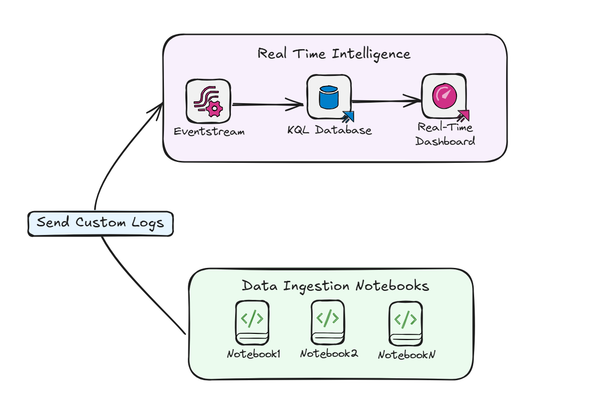

# Fabric Data Ingestion Framework

> **⚠️ DISCLAIMER:** This framework is not an official Microsoft product. It is an independent project designed to help implement data engineering processes in Microsoft Fabric. There is no official support available, and there's a risk that components might break with platform updates. Use at your own risk and thoroughly test before implementing in any critical environment.

## Introduction

The Data Ingestion Framework for Microsoft Fabric is designed to be an aid and a collection of examples demonstrating how to approach common data engineering processes in Microsoft Fabric. Rather than being production-ready code, it serves as an overview of some of the best practices and patterns that can be adapted for your specific needs.

This framework showcases practical implementations for various data engineering challenges in Fabric, from logging data ingestion processes to automating DAG generation.

## Current Components

### Completed Modules

#### 1. [Ingestion Logs with Event Streams](Docs/IngestionLogsWithEventStreams.md)
This module demonstrates how to implement a logging system for data ingestion processes using Event Streams and Event House in Microsoft Fabric. It provides:
- A way to track the status of data ingestion processes
- Integration with Fabric's Event Streams for real-time monitoring
- Examples of error handling and retry logic

  

#### 2. [DAG Generation](Docs/DagGen.md)
This module shows how to programmatically generate Directed Acyclic Graphs (DAGs) for orchestrating data pipelines in Fabric. It leverages the `notebookutils.notebook.runMultiple()` method, which allows you to run multiple notebooks in parallel or with a predefined topological structure. The API uses a multi-thread implementation mechanism within a spark session, meaning that reference notebook runs share compute resources. This module covers:
- Dynamic dependency management
- Simplified orchestration for running multiple notebooks simultaneously 
- Efficient resource utilization by running notebooks in parallel

For more information on `notebookutils.notebook.runMultiple()`, you can visit the [official Microsoft documentation](https://learn.microsoft.com/en-us/fabric/data-engineering/notebook-utilities#reference-run-multiple-notebooks-in-parallel).

## Development Environment

We also provide guidance on setting up your development environment:

- [Developing Locally with VS Code](Docs/DevelopLocallyWithVSCode.md): Configure your local development environment for Fabric projects *(documentation coming soon)*
- [Running GitHub Workflows](Docs/RunningGithubWorkflow.md): Set up CI/CD pipelines for your Fabric projects *(documentation coming soon)*

> **Note:** The documentation for developing locally with VS Code and running GitHub workflows is currently under development and will be completed in upcoming updates. The existing framework code already includes configuration files for both local development and GitHub workflows.

## Roadmap

The framework is still in active development. Here's what we plan to add in the future:

### Upcoming Features

- **Incremental Processing**: Patterns for efficiently handling incremental data loads
- **Parameterization**: Techniques for creating flexible, parameterized pipelines
- **CI/CD**: Comprehensive CI/CD examples for Fabric projects
- **Unit Testing**: Best practices for testing data pipelines
- **Performance Monitoring**: Tools for monitoring Spark workloads across multiple Fabric workspaces using the Fabric and Livy APIs

## Getting Started

To get started with the framework, clone this repository and explore the documentation in the `Docs` folder. Each module has its own documentation with examples and usage instructions.

## Contributing

This project is meant to grow with the community's needs. Feel free to suggest new modules or improvements to existing ones by opening an issue or submitting a pull request.

## Disclaimer

This framework is not intended for production use. It serves as a learning resource and starting point for your own implementations.